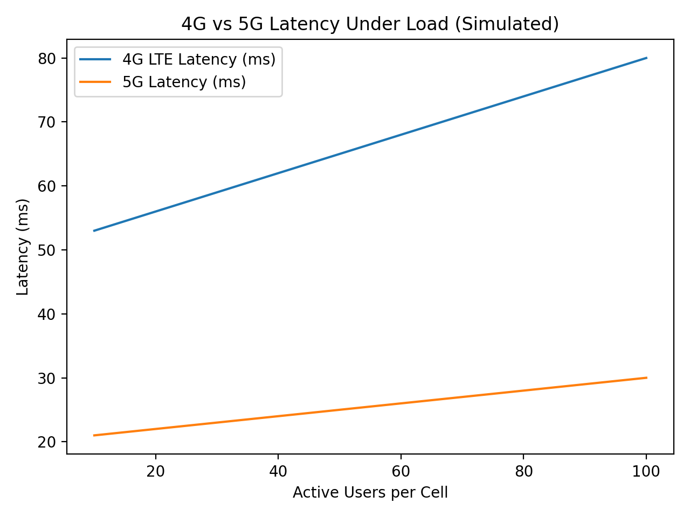

# 4G/5G Mobile Network Architecture + KPI Automation

Beginner-friendly telecom learning project that documents 4G vs 5G architecture and runs KPI checks (latency/throughput/packet loss) via an automated Python test script + GitHub Actions CI.

## Highlights
- High-level 4G/5G architecture diagram (Mermaid)
- KPI validation script that generates a pass/fail report from CSV telemetry
- CI workflow runs tests automatically on push/PR

## Quick start
```bash
python3 scripts/network_kpi_tests.py
python3 scripts/network_kpi_sim.py
```

## Docs
- Architecture: `docs/architecture_overview.md`
- KPI definitions: `docs/kpi_definitions.md`
- KPI test report: `docs/report.md`
- Analysis notes: `docs/analysis.md`

## Outputs


